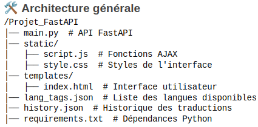

# Cahier des charges - Quantity Estimation

### Activité de l’application
Traduction d'un texte d'une langue à une autre, et évaluation de traducteurs automatiques (à travers évaluation de la qualité de la traduction) sans recours à une traduction de référence, en utilisant la méthode de **Quality Estimation**. Pour cela, nous exploiterons des transformers de type BERT ainsi que des modèles génératifs comme Mistral. Enfin, l'évaluation sera réalisée à l'aide du module **TransQuest**. L'ensemble sera intégré dans une application web avec **FastAPI**.

### Objectifs
Les utilisateurs doivent disposer des fonctionnalités suivantes :  
1. Choisir la langue source et la langue cible
2. Entrer un texte pour obtenir une traduction
3. Obtenir un score de qualité (fiabilité) de la traduction générée
4. Consulter l’historique des traductions et l'exporter en JSON
5. Une interface claire, interactive, intuitive et agréable !

### Besoins
Besoins fonctionnels :
1. Traduction automatique via modèle NLP.
2. Évaluation de la qualité de traduction avec un score.
3. Sélection des langues cibles et sources à partir d’une liste disponible (avec une possible amélioration future pour la détection automatique de la langue source) .
4. Affichage et export de l’historique des traductions.

Besoins techniques :
1. Utilisation de FastAPI pour le backend.
2. Intégration de modèles de traduction et d’évaluation via HappyTransformer (Python).
3. Interface web avec HTML, CSS, JavaScript.
4. Stockage des traductions sous forme de fichier JSON.

Besoins non fonctionnels :
1. Performance : Réponse rapide et utilisation optimisée des ressources CPU.
2. Scalabilité : Possibilité d’ajouter d’autres modèles de traduction à l’avenir.
3. Accessibilité : Interface simple et responsive.

### Public
Des utilisateurs qui ne maîtrisent pas la langue cible et voudraient avoir un feedback sur la qualité de la traduction.

### État de l’art
#### 1. Modèles de Traduction
L’essor de la traduction automatique neuronale (NMT - Neural Machine Translation) a considérablement amélioré la qualité des traductions.  
Plusieurs modèles sont couramment utilisés.

Google Translate :
1. Modèle propriétaire de Google basé sur du Deep Learning.
2. Très efficace, mais payant après un certain volume.
3. Pas d’accès direct aux probabilités de confiance.

DeepL :
1. Connu pour la qualité de ses traductions, particulièrement en langues européennes.
2. Utilise des réseaux de neurones profonds.
3. Payant pour un usage professionnel.

MyMemory :
1. Base de données collaborative de traductions humaines.
2. Gratuit, mais qualité parfois variable.

M2M-100 (Facebook AI) :
1. Modèle open-source capable de traduire directement entre 100 langues.
2. Meilleure qualité que les modèles classiques pour certaines paires de langues.

MarianMT (Helsinki-NLP) :
1. Modèle open-source basé sur Transformer, adapté pour des cas spécifiques.
2. Qualité correcte, mais demande un fine-tuning pour certaines langues.

Mistral :
1. Modèle open-source très adaptable.
2. Demande un fine-tuning pour certaines langues.

## 2. Évaluation de la Traduction
L’évaluation automatique de la qualité des traductions est un défi, car il est difficile de juger sans référence humaine.  
Différentes approches existent.

### 2.1 Scores Classiques : BLEU, METEOR, TER
Ces métriques comparent la traduction générée à une référence humaine (donc mesures basées sur sur une référence humaine) :
1. BLEU (Bilingual Evaluation Understudy) : Basé sur la correspondance des n-grams entre la traduction générée et une traduction de référence.
2. METEOR : Ajoute la prise en compte des synonymes et de la morphologie.
3. TER (Translation Edit Rate) : Mesure le nombre de modifications nécessaires pour transformer la sortie en référence.

### 2.2 Quality Estimation (QE) ou Estimation de Qualité sans référence : TransQuest
Modèle neuronale prédictif basé sur des modèles pré-entraînés de type Transformer, en particulier XLM-RoBERTa et BERT, pour estimer la qualité des traductions.

Deux types de modèles :
1. Sentence-Level QE : Prédit un score de qualité pour une phrase complète.
2. Word-Level QE : Évalue la qualité de chaque mot d’une traduction.

Entrée :
1. Texte source
2. Texte traduit

Sortie :
1. Score de qualité (entre 0 et 1, où 1 signifie une traduction parfaite).

### Identité graphique
Design sobre et efficace :
1. Palette de couleurs : Bleu clair et blanc pour un rendu professionnel.
2. Typographie : Police lisible (Roboto ou Open Sans).
3. Disposition : Formulaire clair, résultats affichés proprement.
4. Logo et icônes : Icônes simples pour guider l’utilisateur (ex. bouton de traduction, téléchargement JSON).

### Conception de l'application

